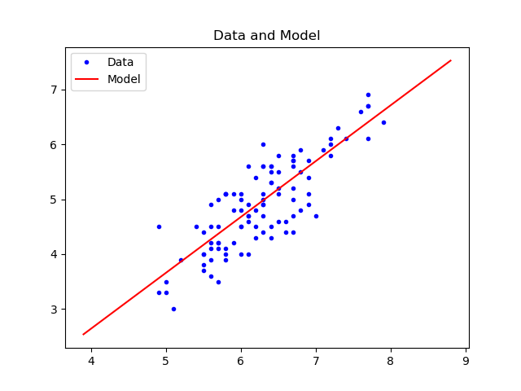
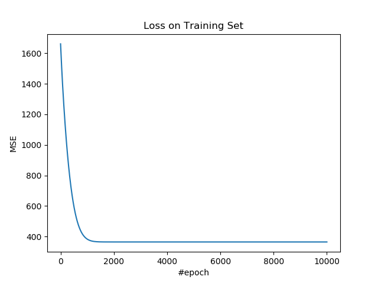
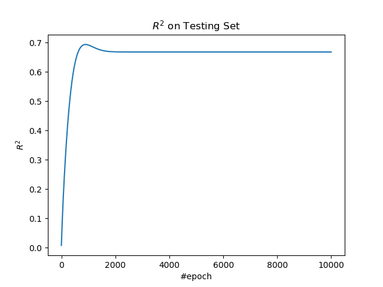

# 1.1 线性回归

线性回归是你能用 TF 搭出来的最简单的模型。

## 操作步骤

导入所需的包。

```py
import tensorflow as tf
import numpy as np
import matplotlib.pyplot as plt
import sklearn.datasets as ds
import sklearn.model_selection as ms
```

定义所需超参数。

| 变量 | 含义 |
| --- | --- |
| `n_data` | 样本量 |
| `n_input` | 样本特征数 |
| `n_epoch` | 迭代数 |
| `lr` | 学习率 |

> 注
> 
> 要注意这篇教程中，为了方便展示，我们进行一元线性回归，但是特征数还是单独定义出来，便于各位扩展。

```py
n_data = 200
n_input = 1
n_epoch = 10000
lr = 0.05
```

生成数据，并进行预处理。

> 注
> 
> 由于数据的范围都差不多，就不标准化了。

```py
x_, y_ = ds.make_regression(n_samples=n_data,
                        n_features=n_input,
                        n_informative=1,
                        n_targets=1,
                        noise = 20.0)

y_ = y_.reshape([n_data, 1])

x_train, x_test, y_train, y_test = \
    ms.train_test_split(x_, y_, train_size=0.7, test_size=0.3)
```

搭建模型。

| 变量 | 含义 |
| --- | --- |
| `x` | 输入 |
| `y` | 真实标签 |
| `w` | 权重 | 
| `b` | 偏置 |
| `z` | 输出，也就是标签预测值 |

```py
x = tf.placeholder(tf.float64, [None, n_input])
y = tf.placeholder(tf.float64, [None, 1])
w = tf.Variable(np.random.rand(n_input, 1))
b = tf.Variable(np.random.rand(1, 1))
z = x @ w + b
```

定义损失、优化操作、和 R 方度量指标。

| 变量 | 含义 |
| --- | --- |
| `loss` | 损失 |
| `op` | 优化操作 |
| `y_mean` | `y`的均值 |
| `r_sqr` | R 方值 |

```py
loss = tf.reduce_mean((z - y) ** 2)
op = tf.train.AdamOptimizer(lr).minimize(loss)

y_mean = tf.reduce_mean(y)
r_sqr = 1 - tf.reduce_sum((y - z) ** 2) / tf.reduce_sum((y - y_mean) ** 2)
```

使用训练集训练模型。

```py
losses = []
r_sqrs = []

with tf.Session() as sess:
    sess.run(tf.global_variables_initializer())
    for e in range(n_epoch):
        _, loss_ = sess.run([op, loss], feed_dict={x: x_train, y: y_train})
        losses.append(loss_)
```

使用测试集计算 R 方。

```py
        r_sqr_ = sess.run(r_sqr, feed_dict={x: x_test, y: y_test})
        r_sqrs.append(r_sqr_)
```

得到`w`和`b`的值：

```py
    w_, b_ = sess.run([w, b])
    w_, b_ = w_[0, 0], b_[0, 0]
```

绘制整个数据集的预测结果。

```py
x_min = x_.min() - 1
x_max = x_.max() + 1
x_rng = np.arange(x_min, x_max, 0.1)
y_rng = x_rng * w_ + b_

plt.figure()
plt.plot(x_, y_, 'b.', label='Data')
plt.plot(x_rng, y_rng, 'r', label='Model')
plt.title('Data and Model')
plt.legend()
plt.show()
```



绘制训练集上的损失。

```py
plt.figure()
plt.plot(losses)
plt.title('Loss on Training Set')
plt.xlabel('#epoch')
plt.ylabel('MSE')
plt.show()
```



绘制测试集上的 R 方。

```py
plt.figure()
plt.plot(r_sqrs)
plt.title('$R^2$ on Testing Set')
plt.xlabel('#epoch')
plt.ylabel('$R^2$')
plt.show()
```



## 扩展阅读

+   [斯坦福 CS229 笔记：二、单变量线性回归](http://www.ai-start.com/ml2014/html/week1.html#header-n178)
+   [斯坦福 CS229 笔记：四、多变量线性回归](http://www.ai-start.com/ml2014/html/week2.html#header-n5)
