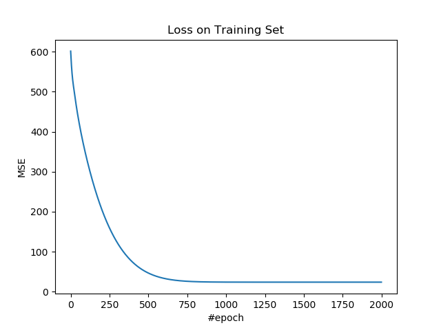
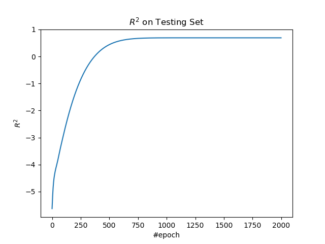

# 1.2 LASSO、岭和 Elastic Net

当参数变多的时候，就要考虑使用正则化进行限制，防止过拟合。

## 操作步骤

导入所需的包。

```py
import tensorflow as tf
import numpy as np
import matplotlib.pyplot as plt
import sklearn.datasets as ds
import sklearn.model_selection as ms
```

导入数据，并进行预处理。我们使用波士顿数据集所有数据的全部特征。

```py
boston = ds.load_boston()

x_ = boston.data
y_ = np.expand_dims(boston.target, 1)

x_train, x_test, y_train, y_test = \
    ms.train_test_split(x_, y_, train_size=0.7, test_size=0.3)
    
mu_train = x_train.mean(0)
sigma_train = x_train.std(0)
x_train = (x_train - mu_train) / sigma_train
x_test = (x_test - mu_train) / sigma_train
```

定义超参数。

```py
n_input = 13
n_epoch = 2000
lr = 0.05
lam = 0.1
l1_ratio = 0.5
```


| 变量 | 含义 |
| --- | --- |
| `n_input` | 样本特征数 |
| `n_epoch` | 迭代数 |
| `lr` | 学习率 |
| `lam` | 正则化系数 |
| `l1_ratio` | L1 正则化比例。如果它是 1，模型为 LASSO 回归；如果它是 0，模型为岭回归；如果在 01 之间，模型为 Elastic Net。 |

搭建模型。

| 变量 | 含义 |
| --- | --- |
| `x` | 输入 |
| `y` | 真实标签 |
| `w` | 权重 | 
| `b` | 偏置 |
| `z` | 输出，也就是标签预测值 |

```py
x = tf.placeholder(tf.float64, [None, n_input])
y = tf.placeholder(tf.float64, [None, 1])
w = tf.Variable(np.random.rand(n_input, 1))
b = tf.Variable(np.random.rand(1, 1))
z = x @ w + b
```

定义损失、优化操作、和 R 方度量指标。

我们在 MSE 基础上加上两个正则项：

$\begin{matrix} L_1 = \lambda_1 \|w\|_1 \\ L_2 = \lambda_2 \|w\|^2 \\ L = L_{MSE} + L_1 + L_2 \end{matrix}$

| 变量 | 含义 |
| --- | --- |
| `mse_loss` | MSE 损失 |
| `l1_loss` | L1 损失 |
| `l2_loss` | L2 损失 |
| `loss` | 总损失 |
| `op` | 优化操作 |
| `y_mean` | `y`的均值 |
| `r_sqr` | R 方值 |

```py
mse_loss = tf.reduce_mean((z - y) ** 2)
l1_loss = lam * l1_ratio * tf.reduce_sum(tf.abs(w))
l2_loss = lam * (1 - l1_ratio) * tf.reduce_sum(w ** 2)
loss = mse_loss + l1_loss + l2_loss
op = tf.train.AdamOptimizer(lr).minimize(loss)

y_mean = tf.reduce_mean(y)
r_sqr = 1 - tf.reduce_sum((y - z) ** 2) / tf.reduce_sum((y - y_mean) ** 2)
```

使用训练集训练模型。

```py
losses = []
r_sqrs = []

with tf.Session() as sess:
    sess.run(tf.global_variables_initializer())
    for e in range(n_epoch):
        _, loss_ = sess.run([op, loss], feed_dict={x: x_train, y: y_train})
        losses.append(loss_)
```

使用测试集计算 R 方。

```py
        r_sqr_ = sess.run(r_sqr, feed_dict={x: x_test, y: y_test})
        r_sqrs.append(r_sqr_)
```

每一百步打印损失和度量值。

```py
        if e % 100 == 0:
            print(f'epoch: {e}, loss: {loss_}, r_sqr: {r_sqr_}')
```

输出：

```
epoch: 0, loss: 601.4143942455931, r_sqr: -5.632461200109857
epoch: 100, loss: 337.83817233312953, r_sqr: -2.8921127959091235
epoch: 200, loss: 205.95485710264686, r_sqr: -1.3905038082279204
epoch: 300, loss: 122.56157140781264, r_sqr: -0.4299323503419834
epoch: 400, loss: 73.34245865955972, r_sqr: 0.13473129501015224
epoch: 500, loss: 46.62652385307641, r_sqr: 0.4391669119513518
epoch: 600, loss: 33.418871666746185, r_sqr: 0.5880392599137905
epoch: 700, loss: 27.51559958401544, r_sqr: 0.6533498987634062
epoch: 800, loss: 25.14275351335227, r_sqr: 0.6787325098436232
epoch: 900, loss: 24.28818622078879, r_sqr: 0.6872955402664112
epoch: 1000, loss: 24.01321943982539, r_sqr: 0.689688496343003
epoch: 1100, loss: 23.93439017638524, r_sqr: 0.6901611522536858
epoch: 1200, loss: 23.914316369424643, r_sqr: 0.690163604062231
epoch: 1300, loss: 23.909792588385457, r_sqr: 0.6901031472929803
epoch: 1400, loss: 23.908894366923214, r_sqr: 0.6900616479035429
epoch: 1500, loss: 23.90873804289015, r_sqr: 0.6900411329923608
epoch: 1600, loss: 23.90871433783755, r_sqr: 0.6900324529674866
epoch: 1700, loss: 23.908711226897406, r_sqr: 0.690029151344134
epoch: 1800, loss: 23.908710876248833, r_sqr: 0.6900280037335323
epoch: 1900, loss: 23.908710842591514, r_sqr: 0.6900276378081478
```

绘制训练集上的损失。

```py
plt.figure()
plt.plot(losses)
plt.title('Loss on Training Set')
plt.xlabel('#epoch')
plt.ylabel('MSE')
plt.show()
```



绘制测试集上的 R 方。

```py
plt.figure()
plt.plot(r_sqrs)
plt.title('$R^2$ on Testing Set')
plt.xlabel('#epoch')
plt.ylabel('$R^2$')
plt.show()
```



## 扩展阅读

+   [斯坦福 CS229 笔记：七、正则化](http://www.ai-start.com/ml2014/html/week3.html#header-n160)
