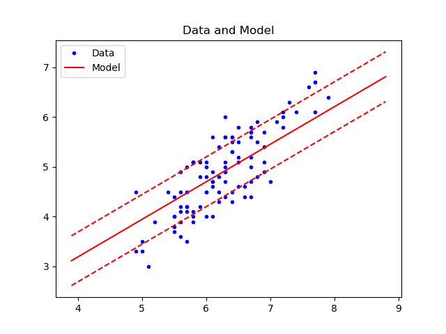
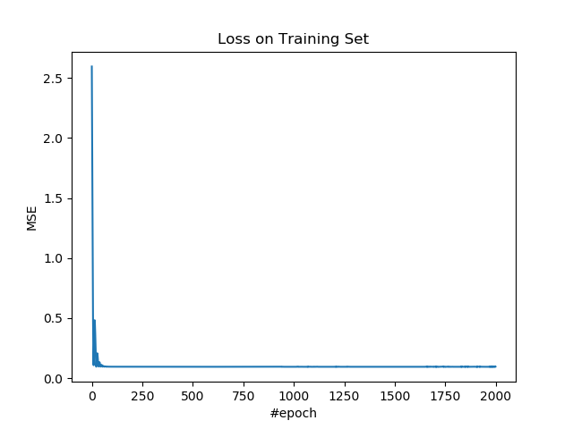
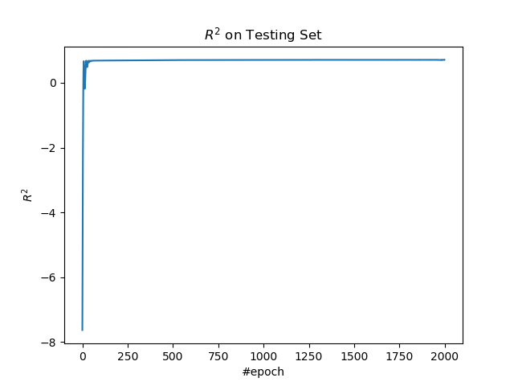

# 2.2 支持向量回归（软间隔）

将上一节的假设改一改，模型就可以用于回归问题。

## 操作步骤

导入所需的包。

```py
import tensorflow as tf
import numpy as np
import matplotlib.pyplot as plt
import sklearn.datasets as ds
import sklearn.model_selection as ms
```

导入数据，并进行预处理。我们使用鸢尾花数据集中的后两个品种，根据萼片长度预测花瓣长度。

```py
iris = ds.load_iris()

x_ = iris.data[50:, 0]
y_ = iris.data[50:, 2]
x_ = np.expand_dims(x_, 1)
y_ = np.expand_dims(y_, 1)

x_train, x_test, y_train, y_test = \
    ms.train_test_split(x_, y_, train_size=0.7, test_size=0.3)
```

定义所需超参数。

| 变量 | 含义 |
| --- | --- |
| `n_input` | 样本特征数 |
| `n_epoch` | 迭代数 |
| `lr` | 学习率 |
| `eps` | 支持边界到决策边界的函数距离 |
| `lam` | L2 正则化函数 |

```py
n_input = 1
n_epoch = 2000
lr = 0.05
eps = 0.5
lam = 0.05
```

搭建模型。

| 变量 | 含义 |
| --- | --- |
| `x` | 输入 |
| `y` | 真实标签 |
| `w` | 权重 | 
| `b` | 偏置 |
| `z` | 输出，也就是标签预测值 |

```py
x = tf.placeholder(tf.float64, [None, n_input])
y = tf.placeholder(tf.float64, [None, 1])
w = tf.Variable(np.random.rand(n_input, 1))
b = tf.Variable(np.random.rand(1, 1))
z = x @ w + b
```

定义损失、优化操作、和 R 方度量指标。

我们使用 Hinge 损失和 L2 的组合。和上一节相比，Hinge 需要改一改：

$mean(\max(|Z - Y| - \epsilon, 0))$

在回归问题中，模型约束相反，是样本落在支持边界内部，也就是 $|Z - Y| \le \epsilon$。我们仍然将其加到损失中，于是，对于满足约束的点，损失为零。对于不满足约束的点，损失为 $|Z - Y| - \epsilon$。这样让样本尽可能到支持边界之外。

L2 损失仍然用于最小化支持边界的几何距离，也就是 $\frac{2}{\|w\|}$。

| 变量 | 含义 |
| --- | --- |
| `hinge_loss` | Hinge 损失 |
| `l2_loss` | L2 损失 |
| `loss` | 总损失 |
| `op` | 优化操作 |
| `y_mean` | `y`的均值 |
| `r_sqr` | R 方值 |

```py
hinge_loss = tf.reduce_mean(tf.maximum(tf.abs(z - y) - eps, 0))
l2_loss = lam * tf.reduce_sum(w ** 2)
loss = hinge_loss + l2_loss
op = tf.train.AdamOptimizer(lr).minimize(loss)

y_mean = tf.reduce_mean(y)
r_sqr = 1 - tf.reduce_sum((y - z) ** 2) / tf.reduce_sum((y - y_mean) ** 2)
```

使用训练集训练模型。

```py
losses = []
r_sqrs = []

with tf.Session() as sess:
    sess.run(tf.global_variables_initializer())
    for e in range(n_epoch):
        _, loss_ = sess.run([op, loss], feed_dict={x: x_train, y: y_train})
        losses.append(loss_)
```

使用测试集计算 R 方。

```py
        r_sqr_ = sess.run(r_sqr, feed_dict={x: x_test, y: y_test})
        r_sqrs.append(r_sqr_)
```

每一百步打印损失和度量值。

```py
        if e % 100 == 0:
            print(f'epoch: {e}, loss: {loss_}, r_sqr: {r_sqr_}')
```

得到拟合直线：

```py
    x_min = x_.min() - 1
    x_max = x_.max() + 1
    x_rng = np.arange(x_min, x_max, 0.1)
    x_rng = np.expand_dims(x_rng, 1)
    y_rng = sess.run(z, feed_dict={x: x_rng})
```

输出：

```
epoch: 0, loss: 2.595811345519854, r_sqr: -7.63455623000992
epoch: 100, loss: 0.09490037816660063, r_sqr: 0.6870450579269822
epoch: 200, loss: 0.0945981212813202, r_sqr: 0.6919725995177556
epoch: 300, loss: 0.0943360378730447, r_sqr: 0.6972100379246203
epoch: 400, loss: 0.0942670608490176, r_sqr: 0.7011480891041979
epoch: 500, loss: 0.09420861968646403, r_sqr: 0.7023977527848786
epoch: 600, loss: 0.09420462812797847, r_sqr: 0.7033420189633286
epoch: 700, loss: 0.09420331500841268, r_sqr: 0.7040990336920706
epoch: 800, loss: 0.09420013554417629, r_sqr: 0.7049244708036546
epoch: 900, loss: 0.09419894883980164, r_sqr: 0.7058068427331468
epoch: 1000, loss: 0.09419596028573823, r_sqr: 0.7063798499792275
epoch: 1100, loss: 0.09439172532153575, r_sqr: 0.7082249152615245
epoch: 1200, loss: 0.0942860145903332, r_sqr: 0.7082847730551416
epoch: 1300, loss: 0.09419431250773326, r_sqr: 0.7085666625849087
epoch: 1400, loss: 0.09419430203474248, r_sqr: 0.7086043351158677
epoch: 1500, loss: 0.09419435727421285, r_sqr: 0.7085638764264852
epoch: 1600, loss: 0.09419436716550869, r_sqr: 0.7085578243219421
epoch: 1700, loss: 0.09422521775113285, r_sqr: 0.7085955861355715
epoch: 1800, loss: 0.09419408061180848, r_sqr: 0.709039512302889
epoch: 1900, loss: 0.09425026677323756, r_sqr: 0.7088910272655065
```

绘制整个数据集的预测结果以及支持边界。

```py
plt.figure()
plt.plot(x_, y_, 'b.', label='Data')
plt.plot(x_rng.ravel(), y_rng.ravel(), 'r', label='Model')
plt.title('Data and Model')
plt.legend()
plt.show()
```



绘制训练集上的损失。

```py
plt.figure()
plt.plot(losses)
plt.title('Loss on Training Set')
plt.xlabel('#epoch')
plt.ylabel('MSE')
plt.show()
```



绘制测试集上的 R 方。

```py
plt.figure()
plt.plot(r_sqrs)
plt.title('$R^2$ on Testing Set')
plt.xlabel('#epoch')
plt.ylabel('$R^2$')
plt.show()
```



## 扩展阅读

+   [Wikipedia: Support vector machine](https://en.wikipedia.org/wiki/Support_vector_machine)
