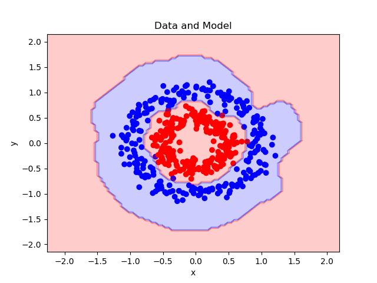
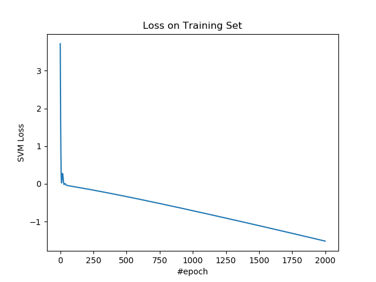
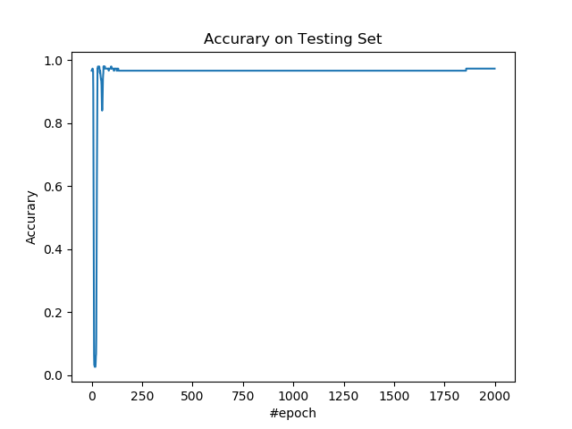

# 2.3 支持向量回归（高斯核）

遇到非线性可分的数据集时，我们需要使用核方法，但为了使用核方法，我们需要返回到拉格朗日对偶的推导过程，不能简单地使用 Hinge 损失。

## 操作步骤

导入所需的包。

```py
import tensorflow as tf
import numpy as np
import matplotlib as mpl
import matplotlib.pyplot as plt
import sklearn.datasets as ds
import sklearn.model_selection as ms
```

为了展示非线性可分的数据集，我们需要把它创建出来。依旧把标签变成 1 和 -1，原标签为 0 的样本标签为 1。

```py
circles = ds.make_circles(n_samples=500, factor=0.5, noise=0.1)

x_ = circles[0]
y_ = (circles[1] == 0).astype(int)
y_[y_ == 0] = -1
y_ = np.expand_dims(y_ , 1)
x_train_, x_test_, y_train_, y_test_ = \
    ms.train_test_split(x_, y_, train_size=0.7, test_size=0.3
```

定义超参数。

| 变量 | 含义 |
| --- | --- |
| `n_batch` | 样本批量大小 |
| `n_input` | 样本特征数 |
| `n_epoch` | 迭代数 |
| `lr` | 学习率 |
| `gamma` | 高斯核系数 |


```py
n_batch = len(x_train_)
n_input = 2
n_epoch = 2000
lr = 0.05
gamma = 10
```

搭建模型。首先定义占位符（数据）和变量（模型参数）。

由于模型参数`a`和样本`x`是对应的，不像之前的`w, b`那样和类别对应，所以需要传入批量大小。并且在预测时，也需要训练集，所以在计算图中，要把训练集和测试集分开。

| 变量 | 含义 |
| --- | --- |
| `x_train` | 输入，训练集的特征 |
| `y_train` | 训练集的真实标签 |
| `a` | 模型参数 |

```py
x_train = tf.placeholder(tf.float64, [n_batch, n_input])
y_train =  tf.placeholder(tf.float64, [n_batch, 1])
a = tf.Variable(np.random.rand(n_batch, 1))
```

定义高斯核。由于高斯核函数是个相对独立，又反复调用的东西，把它写成函数抽象出来。

它的定义是这样的：$\exp(- \gamma \|x - y\|^2)$，`x`和`y`是两个向量。

但在这里，我们要为两个矩阵的每一行计算这个函数，用了一些小技巧。（待补充）

```py
def rbf_kernel(x, y, gamma):
    x_3d_i = tf.expand_dims(x, 1)
    y_3d_j = tf.expand_dims(y, 0)
    kernel = tf.reduce_sum((x_3d_i - y_3d_j) ** 2, 2)
    kernel = tf.exp(- gamma * kernel)
    return kernel

kernel = rbf_kernel(x_train, x_train, gamma)
```

定义损失。我们使用的损失为：

$\frac{1}{n} \big(\sum_{i,j}a_i a_j y^{(i)}y^{(j)}K(x^{(i)},x^{(j)}) - \sum_i a_i \big)$

这个公式的来历请见扩展阅读的第一个链接。

| 变量 | 含义 |
| --- | --- |
| `loss` | 损失 |
| `op` | 优化操作 |

```py
a_cross = a * tf.transpose(a)
y_cross = y_train * tf.transpose(y_train)
loss = tf.reduce_sum(a_cross * y_cross * kernel)
loss -= tf.reduce_sum(a)
loss /= n_batch
op = tf.train.AdamOptimizer(lr).minimize(loss)
```

定义度量指标。我们在测试集上计算它，为此，我们在计算图中定义测试集。

| 变量 | 含义 |
| --- | --- |
| `x_test` | 测试集的特征 |
| `y_test` | 测试集的真实标签 |
| `y_hat` | 标签的预测值 |

```py
x_test = tf.placeholder(tf.float64, [None, n_input])
y_test = tf.placeholder(tf.float64, [None, 1])
kernel_pred = rbf_kernel(x_train, x_test, gamma)
y_hat = tf.transpose(kernel_pred) @ (y_train * a)
y_hat = tf.sign(y_hat - tf.reduce_mean(y_hat))
acc = tf.reduce_mean(tf.to_double(tf.equal(y_hat, y_test)))
```

使用训练集训练模型。

```py
losses = []
accs = []

with tf.Session() as sess:
    sess.run(tf.global_variables_initializer())
    
    for e in range(n_epoch):
        _, loss_ = sess.run([op, loss], feed_dict={x_train: x_train_, y_train: y_train_})
        losses.append(loss_)
```

使用训练集和测试集计算准确率。

```py
        acc_ = sess.run(acc, feed_dict={x_train: x_train_, y_train: y_train_, x_test: x_test_, y_test: y_test_})
        accs.append(acc_)
```

每一百步打印损失和度量值。

```py
        if e % 100 == 0:
            print(f'epoch: {e}, loss: {loss_}, acc: {acc_}')
```

得到决策边界：

```py
    x_plt = x_[:, 0]
    y_plt = x_[:, 1]
    c_plt = y_.ravel()
    x_min = x_plt.min() - 1
    x_max = x_plt.max() + 1
    y_min = y_plt.min() - 1
    y_max = y_plt.max() + 1
    x_rng = np.arange(x_min, x_max, 0.05)
    y_rng = np.arange(y_min, y_max, 0.05)
    x_rng, y_rng = np.meshgrid(x_rng, y_rng)
    model_input = np.asarray([x_rng.ravel(), y_rng.ravel()]).T
    model_output = sess.run(y_hat, feed_dict={x_train: x_train_, y_train: y_train_, x_test: model_input}).astype(int)
    c_rng = model_output.reshape(x_rng.shape)
```

输出：

```
epoch: 0, loss: 3.71520431509184, acc: 0.9666666666666667
epoch: 100, loss: -0.0727806862453766, acc: 0.9733333333333334
epoch: 200, loss: -0.1344057865226747, acc: 0.9666666666666667
epoch: 300, loss: -0.19954100171678735, acc: 0.9666666666666667
epoch: 400, loss: -0.26744944765154044, acc: 0.9666666666666667
epoch: 500, loss: -0.3376130527328746, acc: 0.9666666666666667
epoch: 600, loss: -0.40968204759135396, acc: 0.9666666666666667
epoch: 700, loss: -0.48337264821214987, acc: 0.9666666666666667
epoch: 800, loss: -0.5584322960888252, acc: 0.9666666666666667
epoch: 900, loss: -0.634641530183908, acc: 0.9666666666666667
epoch: 1000, loss: -0.7118203254530981, acc: 0.9666666666666667
epoch: 1100, loss: -0.7898283716352298, acc: 0.9666666666666667
epoch: 1200, loss: -0.8685602440121085, acc: 0.9666666666666667
epoch: 1300, loss: -0.9479390005125, acc: 0.9666666666666667
epoch: 1400, loss: -1.02791046598349, acc: 0.9666666666666667
epoch: 1500, loss: -1.1084388930145652, acc: 0.9666666666666667
epoch: 1600, loss: -1.1895038125649773, acc: 0.9666666666666667
epoch: 1700, loss: -1.2710975807209766, acc: 0.9666666666666667
epoch: 1800, loss: -1.3532232661574393, acc: 0.9666666666666667
epoch: 1900, loss: -1.4358926633795104, acc: 0.9733333333333334
```

绘制整个数据集以及决策边界。

```py
plt.figure()
cmap = mpl.colors.ListedColormap(['r', 'b'])
plt.scatter(x_plt, y_plt, c=c_plt, cmap=cmap)
plt.contourf(x_rng, y_rng, c_rng, alpha=0.2, linewidth=5, cmap=cmap)
plt.title('Data and Model')
plt.xlabel('x')
plt.ylabel('y')
plt.show()
```



绘制训练集上的损失。

```py
plt.figure()
plt.plot(losses)
plt.title('Loss on Training Set')
plt.xlabel('#epoch')
plt.ylabel('Cross Entropy')
plt.show()
```



绘制测试集上的准确率。

```py
plt.figure()
plt.plot(accs)
plt.title('Accurary on Testing Set')
plt.xlabel('#epoch')
plt.ylabel('Accurary')
plt.show()
```



## 扩展阅读

+   [支持向量机通俗导论](https://blog.csdn.net/v_july_v/article/details/7624837)
+   [Wikipedia: Support vector machine](https://en.wikipedia.org/wiki/Support_vector_machine)