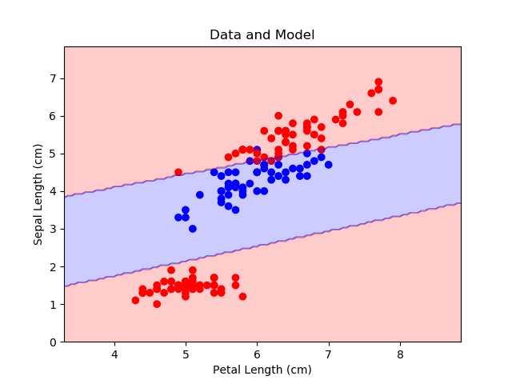
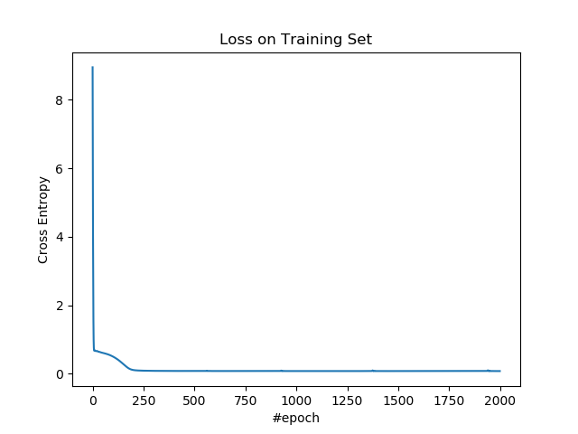
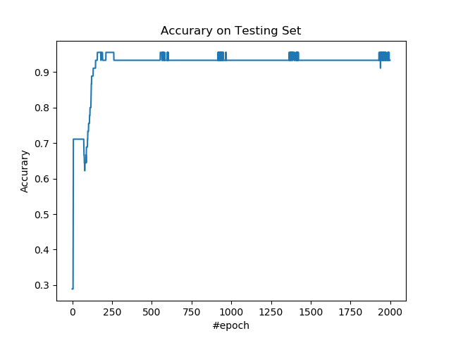

# 4.1 多层感知机（分类）

这篇文章开始就是深度学习了。多层感知机的架构是这样：


输入层除了提供数据之外，不干任何事情。隐层和输出层的每个节点都计算一次线性变换，并应用非线性激活函数。隐层的激活函数是压缩性质的函数。输出层的激活函数取决于标签的取值范围。

其本质上相当于广义线性回归模型的集成。

## 操作步骤

导入所需的包。

```py
import tensorflow as tf
import numpy as np
import matplotlib as mpl
import matplotlib.pyplot as plt
import sklearn.datasets as ds
import sklearn.model_selection as ms
```

导入数据，并进行预处理。我们使用鸢尾花数据集所有样本。根据萼片长度和花瓣长度预测样本是不是杂色鸢尾（第二种）。要注意杂色鸢尾在另外两种之间，所以它不是线性问题。

```py
iris = ds.load_iris()

x_ = iris.data[:, [0, 2]]
y_ = (iris.target == 1).astype(int)
y_ = np.expand_dims(y_ , 1)


x_train, x_test, y_train, y_test = \
    ms.train_test_split(x_, y_, train_size=0.7, test_size=0.3)
```

定义超参数。

| 变量 | 含义 |
| --- | --- |
| `n_input` | 样本特征数 |
| `n_epoch` | 迭代数 |
| `n_hidden1` | 隐层 1 的单元数 |
| `n_hidden2` | 隐层 2 的单元数 |
| `lr` | 学习率 |
| `threshold` | 如果输出超过这个概率，将样本判定为正样本 |

```py
n_input = 2
n_hidden1 = 4
n_hidden2 = 4
n_epoch = 2000
lr = 0.05
threshold = 0.5
```

搭建模型。要注意隐层的激活函数使用了目前暂时最优的 ELU。由于这个是二分类问题，输出层激活函数只能是 Sigmoid。

| 变量 | 含义 |
| --- | --- |
| `x` | 输入 |
| `y` | 真实标签 |
| `w_l{1,2,3}` | 第`{1,2,3}`层的权重 | 
| `b_l{1,2,3}` | 第`{1,2,3}`层的偏置 |
| `z_l{1,2,3}` | 第`{1,2,3}`层的中间变量，前一层输出的线性变换 |
| `a_l{1,2,3}` | 第`{1,2,3}`层的输出，其中`a_l3`样本是正样本的概率 |

```py
x = tf.placeholder(tf.float64, [None, n_input])
y = tf.placeholder(tf.float64, [None, 1])
w_l1 = tf.Variable(np.random.rand(n_input, n_hidden1))
b_l1 = tf.Variable(np.random.rand(1, n_hidden1))
w_l2 = tf.Variable(np.random.rand(n_hidden1, n_hidden2))
b_l2 = tf.Variable(np.random.rand(1, n_hidden2))
w_l3 = tf.Variable(np.random.rand(n_hidden2, 1))
b_l3 = tf.Variable(np.random.rand(1, 1))
z_l1 = x @ w_l1 + b_l1
a_l1 = tf.nn.elu(z_l1)
z_l2 = a_l1 @ w_l2 + b_l2
a_l2 = tf.nn.elu(z_l2)
z_l3 = a_l2 @ w_l3 + b_l3
a_l3 = tf.sigmoid(z_l3)
```

定义交叉熵损失、优化操作、和准确率度量指标。

| 变量 | 含义 |
| --- | --- |
| `loss` | 损失 |
| `op` | 优化操作 |
| `y_hat` | 标签的预测值 |
| `acc` | 准确率 |

```py
loss = - tf.reduce_mean(y * tf.log(a_l3) + (1 - y) * tf.log(1 - a_l3))
op = tf.train.AdamOptimizer(lr).minimize(loss)

y_hat = tf.to_double(a_l3 > threshold)
acc = tf.reduce_mean(tf.to_double(tf.equal(y_hat, y)))
```

使用训练集训练模型。

```py
losses = []
accs = []

with tf.Session() as sess:
    sess.run(tf.global_variables_initializer())
    
    for e in range(n_epoch):
        _, loss_ = sess.run([op, loss], feed_dict={x: x_train, y: y_train})
        losses.append(loss_)
```

使用测试集计算准确率。

```py
        acc_ = sess.run(acc, feed_dict={x: x_test, y: y_test})
        accs.append(acc_)
```

每一百步打印损失和度量值。

```py
        if e % 100 == 0:
            print(f'epoch: {e}, loss: {loss_}, acc: {acc_}')
```

得到决策边界：

```py
    x_plt = x_[:, 0]
    y_plt = x_[:, 1]
    c_plt = y_.ravel()
    x_min = x_plt.min() - 1
    x_max = x_plt.max() + 1
    y_min = y_plt.min() - 1
    y_max = y_plt.max() + 1
    x_rng = np.arange(x_min, x_max, 0.05)
    y_rng = np.arange(y_min, y_max, 0.05)
    x_rng, y_rng = np.meshgrid(x_rng, y_rng)
    model_input = np.asarray([x_rng.ravel(), y_rng.ravel()]).T
    model_output = sess.run(y_hat, feed_dict={x: model_input}).astype(int)
    c_rng = model_output.reshape(x_rng.shape)
```

输出：

```
epoch: 0, loss: 8.951598255929909, acc: 0.28888888888888886
epoch: 100, loss: 0.5002945631529941, acc: 0.7333333333333333
epoch: 200, loss: 0.10712651780120697, acc: 0.9333333333333333
epoch: 300, loss: 0.08321807852608396, acc: 0.9333333333333333
epoch: 400, loss: 0.08013835031876741, acc: 0.9333333333333333
epoch: 500, loss: 0.07905186419367002, acc: 0.9333333333333333
epoch: 600, loss: 0.07850865683940819, acc: 0.9333333333333333
epoch: 700, loss: 0.07808251016428093, acc: 0.9333333333333333
epoch: 800, loss: 0.07780712763974691, acc: 0.9333333333333333
epoch: 900, loss: 0.07759866398922599, acc: 0.9333333333333333
epoch: 1000, loss: 0.07744327666591566, acc: 0.9333333333333333
epoch: 1100, loss: 0.07731295774932465, acc: 0.9333333333333333
epoch: 1200, loss: 0.07721162022836371, acc: 0.9333333333333333
epoch: 1300, loss: 0.07712807776857629, acc: 0.9333333333333333
epoch: 1400, loss: 0.07735547120278226, acc: 0.9333333333333333
epoch: 1500, loss: 0.07700215794853897, acc: 0.9333333333333333
epoch: 1600, loss: 0.07695230759382654, acc: 0.9333333333333333
epoch: 1700, loss: 0.07690933782097598, acc: 0.9333333333333333
epoch: 1800, loss: 0.07687191279304387, acc: 0.9333333333333333
epoch: 1900, loss: 0.07683911419647445, acc: 0.9333333333333333
```

绘制整个数据集以及决策边界。

```py
plt.figure()
cmap = mpl.colors.ListedColormap(['r', 'b'])
plt.scatter(x_plt, y_plt, c=c_plt, cmap=cmap)
plt.contourf(x_rng, y_rng, c_rng, alpha=0.2, linewidth=5, cmap=cmap)
plt.title('Data and Model')
plt.xlabel('Petal Length (cm)')
plt.ylabel('Sepal Length (cm)')
plt.show()
```



绘制训练集上的损失。

```py
plt.figure()
plt.plot(losses)
plt.title('Loss on Training Set')
plt.xlabel('#epoch')
plt.ylabel('Cross Entropy')
plt.show()
```



绘制测试集上的准确率。

```py
plt.figure()
plt.plot(accs)
plt.title('Accurary on Testing Set')
plt.xlabel('#epoch')
plt.ylabel('Accurary')
plt.show()
```



## 扩展阅读

+   [DeepLearningAI 笔记：浅层神经网络](http://www.ai-start.com/dl2017/html/lesson1-week3.html)
+   [DeepLearningAI 笔记：深层神经网络](http://www.ai-start.com/dl2017/html/lesson1-week4.html)
