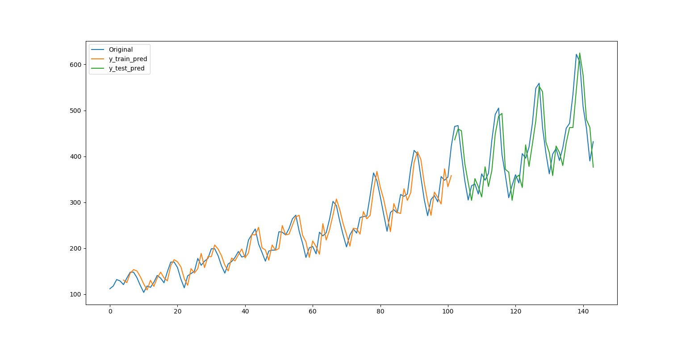
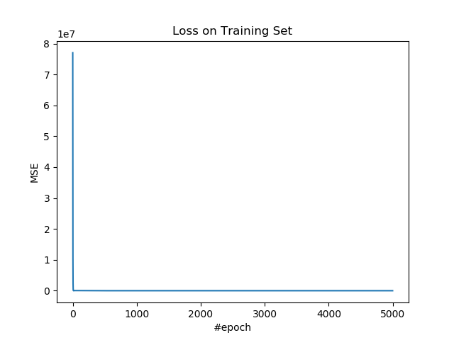
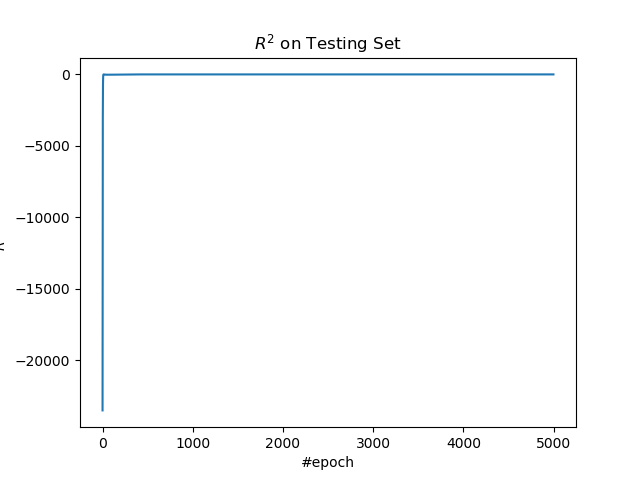

# 4.2 多层感知机回归（时间序列）

这篇教程中，我们使用多层感知机来预测时间序列，这是回归问题。

## 操作步骤

导入所需的包。

```py
import tensorflow as tf
import numpy as np
import pandas as pd
import matplotlib as mpl
import matplotlib.pyplot as plt
```

导入数据，并进行预处理。我们使用[国际航班乘客数据集](https://datamarket.com/data/set/22u3/international-airline-passengers-monthly-totals-in-thousands-jan-49-dec-60)，由于它不存在于任何现有库中，我们需要先下载它。

```py
ts = pd.read_csv('international-airline-passengers.csv', usecols=[1], header=0).dropna().values.ravel()
```

之后，我们需要将其转换为结构化数据集。我知道时间序列有很多实用的特征，但是这篇教程中，为了展示 MLP 的强大，我仅仅使用最简单的特征，也就是乘客数的历史值，并根据历史值来预测当前值。为此，我们需要一个窗口大小，也就是几个历史值与当前值有关。

```py
wnd_sz = 5
ds = []
for i in range(0, len(ts) - wnd_sz + 1):
    ds.append(ts[i:i + wnd_sz])
ds = np.asarray(ds)

x_ = ds[:, 0:wnd_sz - 1]
y_ = ds[:, [wnd_sz - 1]]
```

之后是训练集和测试集的划分。为时间序列划分训练集和测试集的时候，绝对不能打乱，而是应该把前一部分当做训练集，后一部分当做测试集。因为在时间序列中，未来值依赖历史值，而历史值不依赖未来值，这样可以尽可能避免在训练中使用测试集的信息。

```py
train_size = int(len(x_) * 0.7)
x_train = x_[:train_size]
y_train = y_[:train_size]
x_test = x_[train_size:]
y_test  = y_[train_size:]
```

定义超参数。时间序列很容易过拟合，为了避免过拟合，建议不要将迭代数设置太大。

| 变量 | 含义 |
| --- | --- |
| `n_input` | 样本特征数 |
| `n_epoch` | 迭代数 |
| `n_hidden1` | 隐层 1 的单元数 |
| `n_hidden2` | 隐层 2 的单元数 |
| `lr` | 学习率 |

```py
n_input = wnd_sz - 1
n_hidden1 = 8
n_hidden2 = 8
n_epoch = 5000
lr = 0.05
```

搭建模型。要注意隐层的激活函数使用了目前暂时最优的 ELU。由于这个是回归问题，并且标签的取值是正数，输出层激活函数最好是 ReLU，不过我这里用了`f(x)=x`。

| 变量 | 含义 |
| --- | --- |
| `x` | 输入 |
| `y` | 真实标签 |
| `w_l{1,2,3}` | 第`{1,2,3}`层的权重 | 
| `b_l{1,2,3}` | 第`{1,2,3}`层的偏置 |
| `z_l{1,2,3}` | 第`{1,2,3}`层的中间变量，前一层输出的线性变换 |
| `a_l{1,2,3}` | 第`{1,2,3}`层的输出，其中`a_l3`是模型输出 |

```py
x = tf.placeholder(tf.float64, [None, n_input])
y = tf.placeholder(tf.float64, [None, 1])
w_l1 = tf.Variable(np.random.rand(n_input, n_hidden1))
b_l1 = tf.Variable(np.random.rand(1, n_hidden1))
w_l2 = tf.Variable(np.random.rand(n_hidden1, n_hidden2))
b_l2 = tf.Variable(np.random.rand(1, n_hidden2))
w_l3 = tf.Variable(np.random.rand(n_hidden2, 1))
b_l3 = tf.Variable(np.random.rand(1, 1))
z_l1 = x @ w_l1 + b_l1
a_l1 = tf.nn.elu(z_l1)
z_l2 = a_l1 @ w_l2 + b_l2
a_l2 = tf.nn.elu(z_l2)
z_l3 = a_l2 @ w_l3 + b_l3
a_l3 = z_l3
```

定义 MSE 损失、优化操作、和 R 方度量指标。

| 变量 | 含义 |
| --- | --- |
| `loss` | 损失 |
| `op` | 优化操作 |
| `r_sqr` | R 方 |

```py
loss = tf.reduce_mean((a_l3 - y) ** 2)
op = tf.train.AdamOptimizer(lr).minimize(loss)

y_mean = tf.reduce_mean(y)
r_sqr = 1 - tf.reduce_sum((y - z_l3) ** 2) / tf.reduce_sum((y - y_mean) ** 2)
```

使用训练集训练模型。

```py
losses = []
r_sqrs = []

with tf.Session() as sess:
    sess.run(tf.global_variables_initializer())
    
    for e in range(n_epoch):
        _, loss_ = sess.run([op, loss], feed_dict={x: x_train, y: y_train})
        losses.append(loss_)
```

使用测试集计算 R 方。

```py
        r_sqr_ = sess.run(r_sqr, feed_dict={x: x_test, y: y_test})
        r_sqrs.append(r_sqr_)
```

每一百步打印损失和度量值。

```py
        if e % 100 == 0:
            print(f'epoch: {e}, loss: {loss_}, r_sqr: {r_sqr_}')
```

得到模型对训练特征和测试特征的预测值。

```py
    y_train_pred = sess.run(a_l3, feed_dict={x: x_train})
    y_test_pred = sess.run(a_l3, feed_dict={x: x_test})
```

输出：

```
epoch: 0, loss: 77043409.15985592, r_sqr: -23521.326030692493
epoch: 100, loss: 37897.23702800295, r_sqr: -19.354921930720298
epoch: 200, loss: 18649.75640974346, r_sqr: -8.911116248501166
epoch: 300, loss: 2147.5966146602123, r_sqr: -0.37853989085487894
epoch: 400, loss: 1263.5931463538998, r_sqr: -0.07382634204138805
epoch: 500, loss: 1253.7406046664753, r_sqr: -0.06806333648446028
epoch: 600, loss: 1243.1634553133817, r_sqr: -0.05808352824579188
epoch: 700, loss: 1231.6089343016802, r_sqr: -0.047192074052323285
epoch: 800, loss: 1219.1576464110979, r_sqr: -0.03545010651331659
epoch: 900, loss: 1205.8828393813747, r_sqr: -0.022926405676425343
epoch: 1000, loss: 1191.8465646365878, r_sqr: -0.009677859125288402
epoch: 1100, loss: 1177.1062418824404, r_sqr: 0.004243967776722424
epoch: 1200, loss: 1161.7164820448843, r_sqr: 0.018790246715360892
epoch: 1300, loss: 1145.7297771867177, r_sqr: 0.03391350235390089
epoch: 1400, loss: 1129.1971559789824, r_sqr: 0.04956788399307355
epoch: 1500, loss: 1112.1687995644938, r_sqr: 0.06570958355602252
epoch: 1600, loss: 1094.694636052806, r_sqr: 0.08229545885419343
epoch: 1700, loss: 1076.8249437552386, r_sqr: 0.09928154409095935
epoch: 1800, loss: 1058.610974802893, r_sqr: 0.11662268793671471
epoch: 1900, loss: 1040.105609510567, r_sqr: 0.13427233278395379
epoch: 2000, loss: 1021.3640359106001, r_sqr: 0.1521818679367114
epoch: 2100, loss: 1002.4444410104628, r_sqr: 0.17029996348616006
epoch: 2200, loss: 983.4086843952391, r_sqr: 0.18857191001352747
epoch: 2300, loss: 964.3229054480233, r_sqr: 0.2069390069486834
epoch: 2400, loss: 945.2579949977004, r_sqr: 0.22533806131402534
epoch: 2500, loss: 926.2898394552855, r_sqr: 0.24370108009098945
epoch: 2600, loss: 907.4992164430009, r_sqr: 0.26195526740076414
epoch: 2700, loss: 888.9712051573856, r_sqr: 0.280023453768229
epoch: 2800, loss: 870.7939619278964, r_sqr: 0.2978250994434424
epoch: 2900, loss: 853.05672620067, r_sqr: 0.3152780035841527
epoch: 3000, loss: 835.8469673933254, r_sqr: 0.33230081404774603
epoch: 3100, loss: 819.2466742438579, r_sqr: 0.34881635344105677
epoch: 3200, loss: 803.3279326750028, r_sqr: 0.36475564841741825
epoch: 3300, loss: 788.1481237249968, r_sqr: 0.38006238078008847
epoch: 3400, loss: 773.745277047634, r_sqr: 0.39469728985699026
epoch: 3500, loss: 760.1342789234745, r_sqr: 0.4086418985378084
epoch: 3600, loss: 747.3046994934577, r_sqr: 0.42190086156546835
epoch: 3700, loss: 735.2208931432085, r_sqr: 0.4345023183201536
epoch: 3800, loss: 723.8247262865601, r_sqr: 0.44649588706494947
epoch: 3900, loss: 713.0408217593164, r_sqr: 0.45794834867883616
epoch: 4000, loss: 702.78369807874, r_sqr: 0.4689375321627457
epoch: 4100, loss: 692.9657749714121, r_sqr: 0.4795453028091119
epoch: 4200, loss: 683.5050440089381, r_sqr: 0.48985076712787634
epoch: 4300, loss: 674.3313145689638, r_sqr: 0.49992489144728647
epoch: 4400, loss: 665.3902370349782, r_sqr: 0.5098283426678187
epoch: 4500, loss: 656.6442942499, r_sqr: 0.519616563102019
epoch: 4600, loss: 648.0638010180554, r_sqr: 0.5293300601027169
epoch: 4700, loss: 639.5055692785119, r_sqr: 0.5390077718507222
epoch: 4800, loss: 630.981821415558, r_sqr: 0.5487029645939019
epoch: 4900, loss: 622.2826900882102, r_sqr: 0.5586641266805659
```

绘制时间序列及其预测值。

```py
plt.figure()
plt.plot(ts, label='Original')
y_train_pred = np.concatenate([
    [np.nan] * (n_input - 1), 
    y_train_pred.ravel()
])
y_test_pred = np.concatenate([
    [np.nan] * (n_input - 1 + train_size),
    y_test_pred.ravel()
])
plt.plot(y_train_pred, label='y_train_pred')
plt.plot(y_test_pred, label='y_test_pred')
plt.legend()
plt.show()
```



绘制训练集上的损失。

```py
plt.figure()
plt.plot(losses)
plt.title('Loss on Training Set')
plt.xlabel('#epoch')
plt.ylabel('MSE')
plt.show()
```



绘制测试集上的 R 方。

```py
plt.figure()
plt.plot(r_sqrs)
plt.title('$R^2$ on Testing Set')
plt.xlabel('#epoch')
plt.ylabel('$R^2$')
plt.show()
```



## 扩展阅读

+   [DeepLearningAI 笔记：浅层神经网络](http://www.ai-start.com/dl2017/html/lesson1-week3.html)
+   [DeepLearningAI 笔记：深层神经网络](http://www.ai-start.com/dl2017/html/lesson1-week4.html)
+   [如何将时间序列问题转化为监督学习问题](https://blog.csdn.net/qq_30219017/article/details/79539376)
