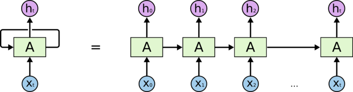
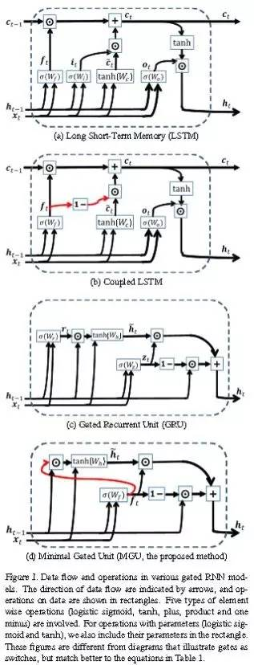
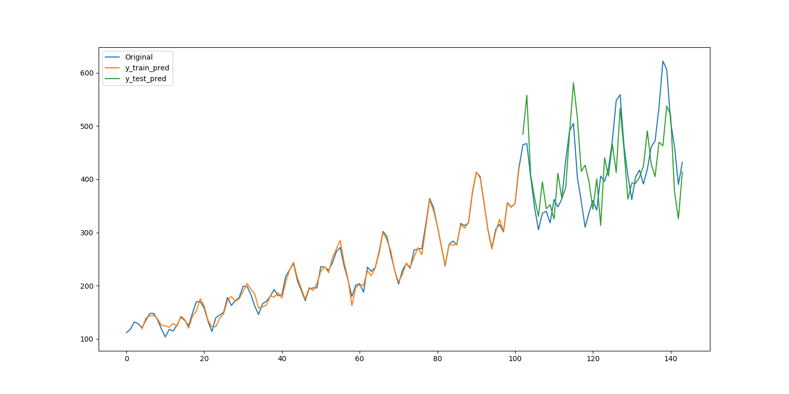
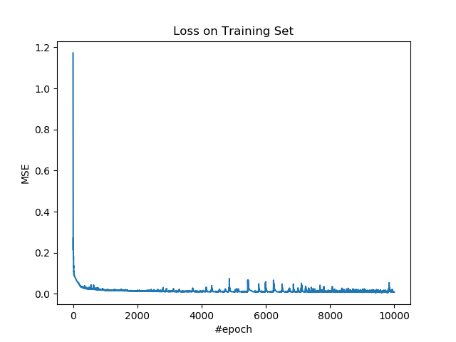
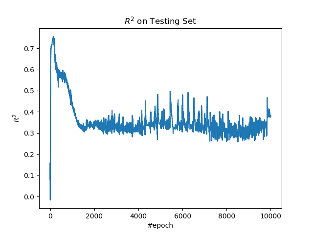

# 5.1 循环神经网络（时间序列）

循环神经网络（RNN）用于建模带有时间关系的数据。它的架构是这样的。



在最基本的 RNN 中，单元（方框）中的操作和全连接层没什么区别，都是线性变换和激活。它完全可以看做多个全连接层的横向扩展。

但是操作数量多了之后，就会有梯度消失和爆炸的问题，于是人们改良了 RNN 单元，添加了精巧的结构来避免这样问题。这是 RNN 的几种改良结构：



## 操作步骤

导入所需的包。

```py
import tensorflow as tf
import numpy as np
import pandas as pd
import matplotlib as mpl
import matplotlib.pyplot as plt
```

导入数据，并进行预处理。我们使用[国际航班乘客数据集](https://datamarket.com/data/set/22u3/international-airline-passengers-monthly-totals-in-thousands-jan-49-dec-60)，由于它不存在于任何现有库中，我们需要先下载它。

```py
ts = pd.read_csv('international-airline-passengers.csv', usecols=[1], header=0).dropna().values.ravel()
```

之后，我们需要将其转换为 RNN 单元可以接受的格式。可接受的格式是三维的，维度分别表示样本、时间和特征。我们需要一个窗口大小，表示几个历史值与当前值有关，然后我们按照它来切分时间序列，就能得到样本。

我仅仅使用原始特征，也就是乘客数量。我并不是表明 RNN 预测得有多好，只是告诉大家 RNN 怎么用。以后有了更好的特征再补充。

```py
wnd_sz = 5
ds = []
for i in range(0, len(ts) - wnd_sz + 1):
    ds.append(ts[i:i + wnd_sz])
ds = np.asarray(ds)

x_ = ds[:, 0:wnd_sz - 1]
y_ = ds[:, [wnd_sz - 1]]
x_ = np.expand_dims(x_, 2)
```

之后是训练集和测试集的划分。同样要注意绝对不能打乱。

```py
train_size = int(len(x_) * 0.7)
x_train = x_[:train_size]
y_train = y_[:train_size]
x_test = x_[train_size:]
y_test  = y_[train_size:]
```

由于 RNN 单元里面使用了`tanh`激活函数，它对于数据的尺度非常敏感，我们需要将数据标准化。但是，如果我们遵循传统方法，就发现效果不是很好，RNN 甚至不能预测趋势。观察数据集就会发现，后面的数据明显大于前面的数据。如果我们使用训练集的均值和标准差来标准化，仍旧是如此。换句话说，对于训练集来说，测试集是“新的分布”。所以我们分别计算训练集和测试集的均值和标准差，并使用它们自己的均值和标准差，将训练集和测试集标准化。

```py
x_mu_train = x_train.mean(0)
x_sigma_train = x_train.std(0)
y_mu_train = y_train.mean(0)
y_sigma_train = y_train.std(0)
x_train = (x_train - x_mu_train) / x_sigma_train
y_train = (y_train - y_mu_train) / y_sigma_train
x_mu_test = x_test.mean(0)
x_sigma_test = x_test.std(0)
y_mu_test = y_test.mean(0)
y_sigma_test = y_test.std(0)
x_test = (x_test - x_mu_test) / x_sigma_test
y_test = (y_test - y_mu_test) / y_sigma_test
```

定义超参数。

| 变量 | 含义 |
| --- | --- |
| `n_step` | 时间步长 |
| `n_input` | 样本特征数 |
| `n_epoch` | 迭代数 |
| `n_hidden` | 循环层的单元数 |
| `n_output` | 输出层单元数 |
| `lr` | 学习率 |

```py
n_step = wnd_sz - 1
n_input = 1
n_hidden = 4
n_output = 1
n_epoch = 10000
lr = 0.1
```

搭建模型。循环层之后添加了一个输出层，目的是把循环层输出的四个特征压缩为一个特征，与标签匹配。

| 变量 | 含义 |
| --- | --- |
| `x` | 输入 |
| `y` | 真实标签 |
| `cell` | 循环层 | 
| `w_l2` | 输出层的权重 | 
| `b_l2` | 输出层的偏置 |
| `h_l1` | 循环层的输出 |
| `h_l2` | 模型的输出 |

```py
x = tf.placeholder(tf.float64, [None, n_step, n_input])
y = tf.placeholder(tf.float64, [None, n_output])
cell = tf.nn.rnn_cell.GRUCell(n_hidden)
w_l2 = tf.Variable(np.random.rand(n_hidden, n_output))
b_l2 = tf.Variable(np.random.rand(1, n_output))

h_l1, _ = tf.nn.dynamic_rnn(cell, x, dtype=tf.float64)
h_l2 = h_l1[:, -1] @ w_l2 + b_l2
```

定义 MSE 损失、优化操作、和 R 方度量指标。

| 变量 | 含义 |
| --- | --- |
| `loss` | 损失 |
| `op` | 优化操作 |
| `r_sqr` | R 方 |

```py
loss = tf.reduce_mean((h_l2 - y) ** 2)
op = tf.train.AdamOptimizer(lr).minimize(loss)

y_mean = tf.reduce_mean(y)
r_sqr = 1 - tf.reduce_sum((y - h_l2) ** 2) / tf.reduce_sum((y - y_mean) ** 2)
```

使用训练集训练模型。

```py
losses = []
r_sqrs = []

with tf.Session() as sess:
    sess.run(tf.global_variables_initializer())
    
    for e in range(n_epoch):
        _, loss_ = sess.run([op, loss], feed_dict={x: x_train, y: y_train})
        losses.append(loss_)
```

使用测试集计算 R 方。

```py
        r_sqr_ = sess.run(r_sqr, feed_dict={x: x_test, y: y_test})
        r_sqrs.append(r_sqr_)

```

每一百步打印损失和度量值。

```py
        if e % 100 == 0:
            print(f'epoch: {e}, loss: {loss_}, r_sqr: {r_sqr_}')
```

得到模型对训练特征和测试特征的预测值。

```py
    y_train_pred = sess.run(h_l2, feed_dict={x: x_train})
    y_test_pred = sess.run(h_l2, feed_dict={x: x_test})
    y_train_pred = y_train_pred * y_sigma_train + y_mu_train
    y_test_pred = y_test_pred * y_sigma_test + y_mu_test
```

输出：

```
epoch: 0, loss: 1.172066950288726, r_sqr: 0.08181895235767012
epoch: 100, loss: 0.06762743481295605, r_sqr: 0.74114029701611
epoch: 200, loss: 0.04335752219908887, r_sqr: 0.6723681622904742
epoch: 300, loss: 0.030765678607308333, r_sqr: 0.6122519542608709
epoch: 400, loss: 0.0255667258649117, r_sqr: 0.5849438991657725
epoch: 500, loss: 0.027757059089794138, r_sqr: 0.5547220968537527
epoch: 600, loss: 0.02280867896340781, r_sqr: 0.5770103850696798
epoch: 700, loss: 0.021203888157209534, r_sqr: 0.5588744061563752
epoch: 800, loss: 0.020631124908383643, r_sqr: 0.5340900532988054
epoch: 900, loss: 0.01848138445620317, r_sqr: 0.4793500483558242
epoch: 1000, loss: 0.01750574268333934, r_sqr: 0.4363987472239601
epoch: 1100, loss: 0.019063501795946507, r_sqr: 0.39722141072773787
epoch: 1200, loss: 0.0162686638744368, r_sqr: 0.3656020052876743
epoch: 1300, loss: 0.01700178459519973, r_sqr: 0.34215312925023267
epoch: 1400, loss: 0.01680496271967236, r_sqr: 0.32958240891225643
epoch: 1500, loss: 0.022387361152892183, r_sqr: 0.311875062539985
epoch: 1600, loss: 0.01692835079726568, r_sqr: 0.31973211945726576
epoch: 1700, loss: 0.014981184565736732, r_sqr: 0.34878737027421214
epoch: 1800, loss: 0.015259222044438638, r_sqr: 0.34762914874016715
epoch: 1900, loss: 0.013233242381529384, r_sqr: 0.33428957917112656
epoch: 2000, loss: 0.013406887787008756, r_sqr: 0.33925822033716413
epoch: 2100, loss: 0.014663732662643054, r_sqr: 0.347748811545596
epoch: 2200, loss: 0.013725021637547831, r_sqr: 0.3537942857251979
epoch: 2300, loss: 0.012930256601236268, r_sqr: 0.34525246614475136
epoch: 2400, loss: 0.013634394369979042, r_sqr: 0.31935143022735935
epoch: 2500, loss: 0.012295407249325577, r_sqr: 0.32843801172553166
epoch: 2600, loss: 0.012086876034542369, r_sqr: 0.2944659162449187
epoch: 2700, loss: 0.011431132027934963, r_sqr: 0.3320304352651986
epoch: 2800, loss: 0.026766484877065972, r_sqr: 0.3516603080525481
epoch: 2900, loss: 0.013249484588141427, r_sqr: 0.32412481149383066
epoch: 3000, loss: 0.01105305279694339, r_sqr: 0.3292310540476926
epoch: 3100, loss: 0.011470806104939772, r_sqr: 0.3297084772513311
epoch: 3200, loss: 0.011529391738337445, r_sqr: 0.32604568271503975
epoch: 3300, loss: 0.016529603402840765, r_sqr: 0.3043582054899223
epoch: 3400, loss: 0.013990350362048133, r_sqr: 0.3199655109188301
epoch: 3500, loss: 0.01153881610786597, r_sqr: 0.3133999574164319
epoch: 3600, loss: 0.012797147535482193, r_sqr: 0.31258610293795597
epoch: 3700, loss: 0.011476855518680756, r_sqr: 0.34671798591970837
epoch: 3800, loss: 0.010467519750448642, r_sqr: 0.3104500031552391
epoch: 3900, loss: 0.010726962231936567, r_sqr: 0.3138785388392976
epoch: 4000, loss: 0.011354515890079096, r_sqr: 0.3439112763768726
epoch: 4100, loss: 0.010956935944379312, r_sqr: 0.33047301867737333
epoch: 4200, loss: 0.010516217542845503, r_sqr: 0.3169866902021138
epoch: 4300, loss: 0.017644784078390447, r_sqr: 0.30790429205962355
epoch: 4400, loss: 0.010311798410482015, r_sqr: 0.33750001847417244
epoch: 4500, loss: 0.012096887824821146, r_sqr: 0.3483536401639381
epoch: 4600, loss: 0.010336452329588753, r_sqr: 0.333357260461554
epoch: 4700, loss: 0.010768585264597813, r_sqr: 0.3286332805909209
epoch: 4800, loss: 0.010187296826748472, r_sqr: 0.3508737658734946
epoch: 4900, loss: 0.012830964380652418, r_sqr: 0.38883425472040245
epoch: 5000, loss: 0.010034723893693883, r_sqr: 0.34865494006975606
epoch: 5100, loss: 0.018500185229121037, r_sqr: 0.37866142043477613
epoch: 5200, loss: 0.010063261243586386, r_sqr: 0.34191028337439755
epoch: 5300, loss: 0.011189870387229503, r_sqr: 0.34997022979225245
epoch: 5400, loss: 0.011487597291485683, r_sqr: 0.31996396612360156
epoch: 5500, loss: 0.018130474919110774, r_sqr: 0.40163834751360294
epoch: 5600, loss: 0.010631864046823009, r_sqr: 0.31888613030550417
epoch: 5700, loss: 0.010235333409754856, r_sqr: 0.33371577618904724
epoch: 5800, loss: 0.017054583875343695, r_sqr: 0.4573069550292207
epoch: 5900, loss: 0.010375495082076958, r_sqr: 0.34263745746177443
epoch: 6000, loss: 0.02899888987961715, r_sqr: 0.4731489130962029
epoch: 6100, loss: 0.009635932593390793, r_sqr: 0.3377314247566131
epoch: 6200, loss: 0.009756606958491803, r_sqr: 0.3433460486517317
epoch: 6300, loss: 0.015849799410205617, r_sqr: 0.38774652539473653
epoch: 6400, loss: 0.00952936061724416, r_sqr: 0.3316576525214012
epoch: 6500, loss: 0.01726899798192304, r_sqr: 0.3273077681611758
epoch: 6600, loss: 0.009523356787685604, r_sqr: 0.3307726070509249
epoch: 6700, loss: 0.012766831260869482, r_sqr: 0.3307548009627649
epoch: 6800, loss: 0.009289520442372325, r_sqr: 0.32373411787154416
epoch: 6900, loss: 0.011158193836457308, r_sqr: 0.32997251352858914
epoch: 7000, loss: 0.02869441623350593, r_sqr: 0.3338995201916093
epoch: 7100, loss: 0.018485258063551675, r_sqr: 0.2938792287466744
epoch: 7200, loss: 0.008861181401821593, r_sqr: 0.32004037549190045
epoch: 7300, loss: 0.00867730190276807, r_sqr: 0.31307907559266057
epoch: 7400, loss: 0.010568595192759116, r_sqr: 0.3007627324642683
epoch: 7500, loss: 0.008931675261205094, r_sqr: 0.3355236299841886
epoch: 7600, loss: 0.01437912261193081, r_sqr: 0.3118478993546139
epoch: 7700, loss: 0.013553350799683056, r_sqr: 0.3492071104037119
epoch: 7800, loss: 0.030876872968019105, r_sqr: 0.31738784411969434
epoch: 7900, loss: 0.010089701030161817, r_sqr: 0.3301184791799566
epoch: 8000, loss: 0.01147013359703656, r_sqr: 0.30306917655113186
epoch: 8100, loss: 0.009855414853123119, r_sqr: 0.34582101555677947
epoch: 8200, loss: 0.014423066317111677, r_sqr: 0.3470667522167451
epoch: 8300, loss: 0.011664752107448714, r_sqr: 0.32157739869359203
epoch: 8400, loss: 0.009646714124369984, r_sqr: 0.3355179490543708
epoch: 8500, loss: 0.008793324000994002, r_sqr: 0.2839973244304941
epoch: 8600, loss: 0.009740176108560508, r_sqr: 0.324717537310496
epoch: 8700, loss: 0.008509925688666948, r_sqr: 0.29162404590044055
epoch: 8800, loss: 0.00935785011763191, r_sqr: 0.2925641966682784
epoch: 8900, loss: 0.010778117882046828, r_sqr: 0.2969009246659946
epoch: 9000, loss: 0.008386197722733947, r_sqr: 0.31203296266480274
epoch: 9100, loss: 0.01152050463672165, r_sqr: 0.32619935954711543
epoch: 9200, loss: 0.008279818958514217, r_sqr: 0.3172741922458261
epoch: 9300, loss: 0.00767664017767626, r_sqr: 0.33894394589120425
epoch: 9400, loss: 0.0093665602478405, r_sqr: 0.3409878486332283
epoch: 9500, loss: 0.014677227625938132, r_sqr: 0.3553809732953209
epoch: 9600, loss: 0.008036392158721397, r_sqr: 0.33729133931823474
epoch: 9700, loss: 0.011275509041766035, r_sqr: 0.30956775357004673
epoch: 9800, loss: 0.00885348178403466, r_sqr: 0.3402377958439502
epoch: 9900, loss: 0.009747783923937898, r_sqr: 0.3843754214763523
```

绘制时间序列及其预测值。

```py
plt.figure()
plt.plot(ts, label='Original')
y_train_pred = np.concatenate([
    [np.nan] * n_input, 
    y_train_pred.ravel()
])
y_test_pred = np.concatenate([
    [np.nan] * (n_input + train_size),
    y_test_pred.ravel()
])
plt.plot(y_train_pred, label='y_train_pred')
plt.plot(y_test_pred, label='y_test_pred')
plt.legend()
plt.show()
```



绘制训练集上的损失。

```py
plt.figure()
plt.plot(losses)
plt.title('Loss on Training Set')
plt.xlabel('#epoch')
plt.ylabel('MSE')
plt.show()
```



绘制测试集上的 R 方。

```py
plt.figure()
plt.plot(r_sqrs)
plt.title('$R^2$ on Testing Set')
plt.xlabel('#epoch')
plt.ylabel('$R^2$')
plt.show()
```



## 扩展阅读

+   [理解 LSTM 网络](https://github.com/wizardforcel/data-science-notebook/blob/master/dl/%E7%90%86%E8%A7%A3_LSTM_%E7%BD%91%E7%BB%9C.md)
+   [机器学习实用指南：十四、循环神经网络](https://hand2st.apachecn.org/#/docs/14.%E5%BE%AA%E7%8E%AF%E7%A5%9E%E7%BB%8F%E7%BD%91%E7%BB%9C)
+   [DeepLearningAI 笔记：序列模型](http://www.ai-start.com/dl2017/html/lesson5-week1.html)
